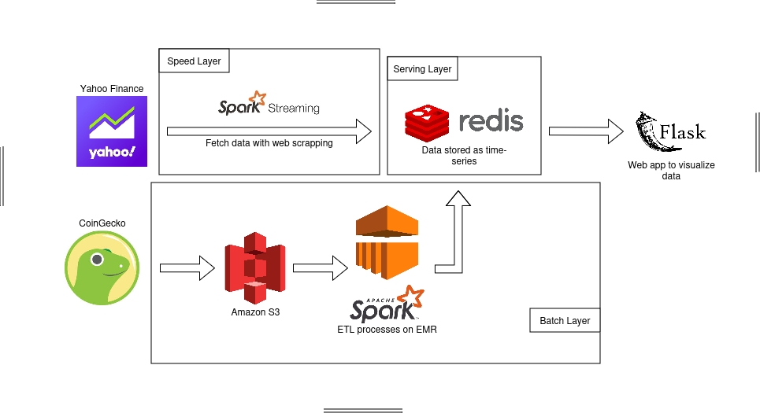
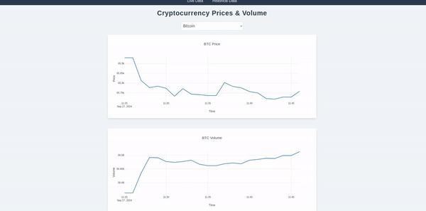
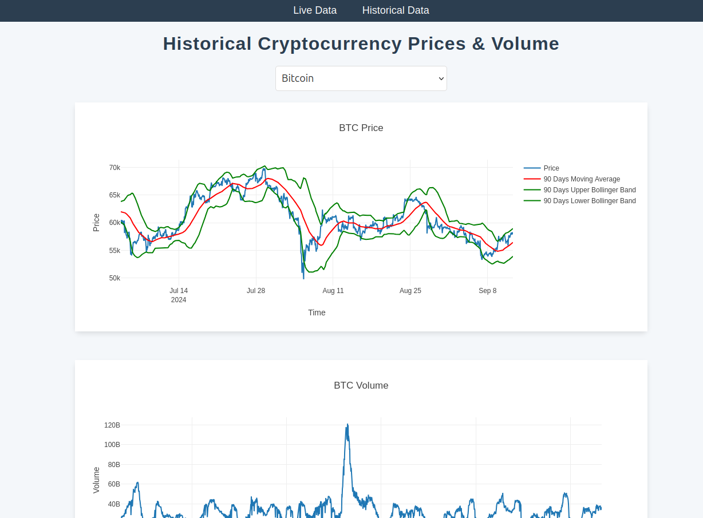

# Crypto Data Pipeline

This project aims to create a data pipeline that fetches, stores and transforms cryptocurrency data from Yahoo Finance and CoinGecko. The data is displayed both:
 - In real time with basic informations (price, volume).
 - In a consolidated view where the data is refreshed less often but displayed with indicators (forecasts, KPIs, ...)

## Architecture

The project is built with a Lambda architecture:
- **Speed Layer:** Basic data (price, volume) is regularly scraped (every minute) from Yahoo Finance website and processed with Spark Streaming and then uploaded to redis.
- **Batch Layer:**
    - For each cryptocurrency, a sample containing the price and volume data of the last 90 days is extracted periodically (every hour) with CoinGecko API and uploaded to Amazon S3.
    - Data is processed with Spark in Amazon EMR to calculate measures such as moving average or forecasts and uploaded in Redis.
- **Serving Layer:** Redis is used to store data using the TimeSeries format.

## Overview

